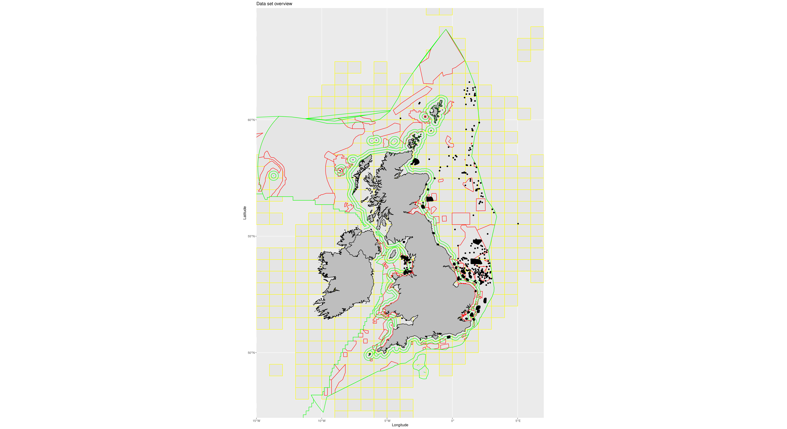

# The fish finder

## Introduction

Assuming that your unmanned autonomous vehicle is based at Lowestoft
in Suffolk, where would be the best place to send it fishing?

Your answer should consider profit maximisation, sustainability and
logistics. Please provide data and illustrations to support your
conclusions. Please document any assumptions that you make.

You are asked to present your conclusions at an investor event
scheduled for Thursday evening.

## Data

We have provided a selection of data sets for you to use (see Figure 1
for an overview), but you are free to use any available data. Please
acknowledge the source of any additional data that you use.

Figure 1, Data overview. ICES grid squares shown in yellow. Wind
turbines and oil and gas platforms shown as black dots. Marine
protected areas shown in red. UK maritime limits shown in green.

### Maritime limits and boundaries.

See [JNCC MPA mapper](https://jncc.gov.uk/mpa-mapper/) and [UK
Hydrographic Office Maritime Limits and
Boundaries](https://data.admiralty.co.uk/portal/apps/sites/#/marine-data-portal/items/b9bcb1a1ef644bd7a94be282d8ff38c5).

`UK_Hydrographic_Office_Maritime_Limits_and_Boundaries.zip`

Shapefile. No licence specified.

### UK offshore marine protected areas

See [JNCC MPA mapper](https://jncc.gov.uk/mpa-mapper/) and [UK
Offshore Marine Protected Areas
2020](https://hub.jncc.gov.uk/assets/ade43f34-54d6-4084-b66a-64f0b4a5ef27)

`c20201214-OffshoreMPAs-WGS84.zip`

Shapefile. No licence specified.

### Fish landing data by ICES grid square

See [UK Sea Fisheries 2020](https://storymaps.arcgis.com/stories/012e529682ef43ebb1e9a5caf94a0b27).

`MMO_UnitedKingdomFishLandingsbyICESRectangleAllVessels2016_SHP_Full.zip`

Shapefile. Open Government Licence v3.0. Crown Copyright 2019.

### Map of The British Isles

`british-isles`

These data were extracted from the GADM database (www.gadm.org),
version 2.5, July 2015. They can be used for non-commercial purposes
only.  It is not allowed to redistribute these data, or use them for
commercial purposes, without prior consent.

### Infrastructure data

Oil and gas platforms `platforms.csv`.

Wind farms `wind-farms.csv`.

See [ADMIRALTY Marine Data
Portal](https://www.gov.uk/guidance/inspire-portal-and-medin-bathymetry-data-archive-centre).

These data were extracted and down-sampled from the United Kingdom
Hydrographic Office infrastructure data set. The files contain Crown
Copyright data kindly provided by special permission of United Kingdom
Hydrographic Office and must not be copied, made public or used for
any purposes except this exercise. They are not included in thsi repo,
but are available from Rob Blackwell on request.

## Disclaimer

Please note that this an exercise for training purposes. All concepts
portrayed in the materials are fictitious. No identification with
actual Cefas projects or policies is intended or should be inferred.

The materials are provided for training purposes only and must not be
copied, made public or used for any purposes except this exercise.
